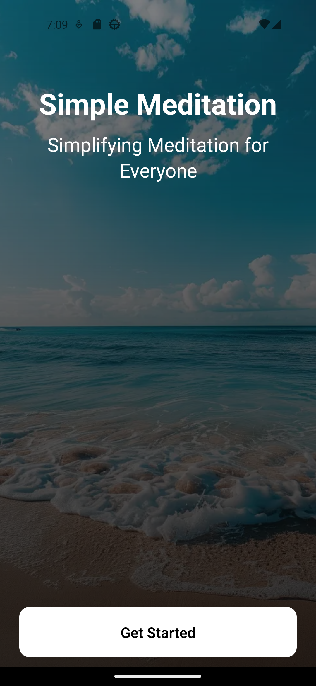
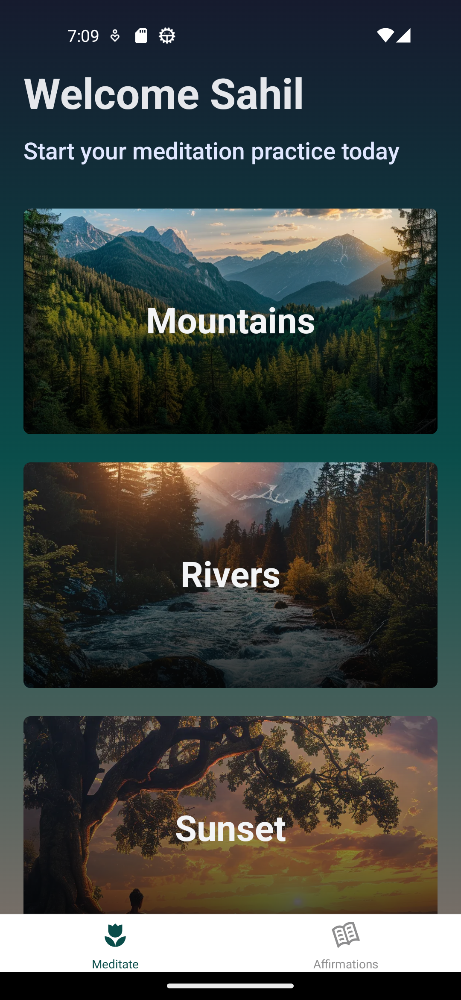
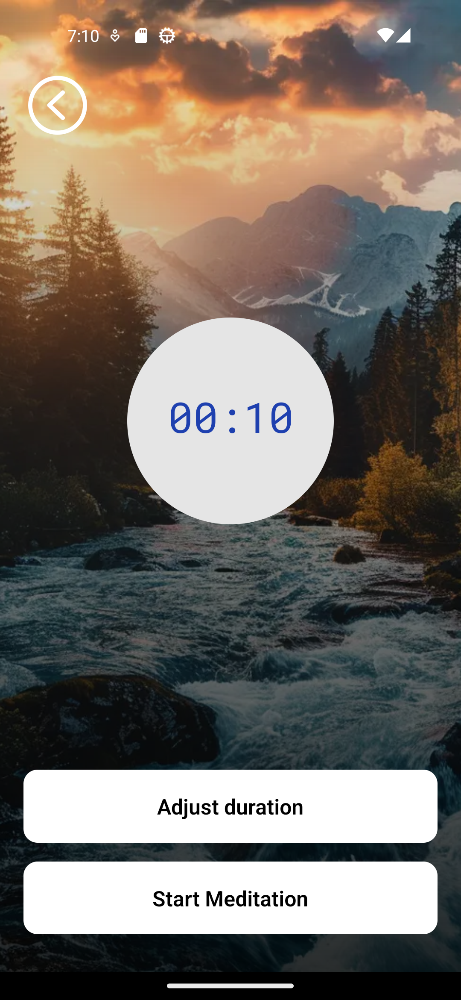

# Meditation and Affirmations app

This project is a simple Meditation App developed following a YouTube tutorial. The main goal was to gain a foundational understanding of React Native, including its folder structure and best practices.

<div style="display: flex; justify-content: space-around;">
  
  
  
</div>

## <a name="tech-stack">⚙️ Tech Stack</a>

- React Native
- Expo
- NativeWind
- JavaScript
- TypeScript

## <a name="features">🔋 Features</a>

👉 **Onboarding Screen**: Welcome screen with a linear gradient to help users get started with the app.

👉 **Meditation List Screen with Flat List**: A flat list displays previews of various meditations with corresponding images.

👉 **Audio Playing Capability**: Control audio playback and manage a meditation countdown timer.

👉 **Tab Navigation**: Navigate between sections like the Meditation Screen and Affirmations screen with ease using tab navigation.

👉 **Responsiveness**: Smooth performance and adaptability across various devices and screen sizes for a consistent user experience.

and many more, including code architecture and reusability

## <a name="quick-start">🤸 Quick Start</a>

Follow these steps to set up the project locally on your machine.

**Prerequisites**

Make sure you have the following installed on your machine:

- [Git](https://git-scm.com/)
- [Node.js](https://nodejs.org/en)
- [npm](https://www.npmjs.com/) (Node Package Manager)

**Cloning the Repository**

```bash
git clone https://github.com/stevenGarciaDev/simple-meditation-app-expo-react-native.git
cd simple-meditation-app-expo-react-native
```

**Installation**

Install the project dependencies using npm:

```bash
npm install
```

**Running the Project**

```bash
npx expo start
```

**Expo Go**

Download the [Expo Go](https://expo.dev/go) app onto your device, then use it to scan the QR code from Terminal and run.

**iOS Simulator**

Navigate to the [Expo documentation](https://docs.expo.dev/workflow/ios-simulator/) to learn how to install and run your application on an iOS Simulator for local development.

**Android Emulator**

Navigate to the [Expo documentation](https://docs.expo.dev/workflow/android-studio-emulator/) to learn how to install and run your application on an Android Emulator for local development.
